# Noto

#### Noto is a note-taking app built using JavaScript, React and Ruby on Rails developed by [Justin Lee](https://github.com/JLee-WD) and [Richard Cho](https://github.com/Ryuukishi/).

Github Link:
[https://github.com/Noto-App/Noto](https://github.com/Noto-App/Noto)

## Purpose

### Problem

Students oftentimes have trouble understanding reference websites or perhaps the official documentation is too verbose and hard to read. Taking good notes is an important skill when studying because it not only helps you to remember the content, but it also reinforces the concepts by writing it down in words that makes sense to you. This could be difficult, however, if it is something that they have learnt but not yet written down, or maybe their written notes are an unorganized mess.

It is common for students in the same class to learn at different speeds. Different students will excel in different areas and not all students will understand the content in the same way. Collaboration and note taking solves this by encouraging communication and teamwork between students. Fostering a collaborative environment is a powerful tool that motivates students to share their knowledge and help each other to succeed.

Sometimes there's a tried and true method of doing something that you want to keep a note of, or a line of code that you would like to reuse in the future. If you don't take a note of it, it's highly likely that you'll end up forgettting it and be forced to search for it again in Google which is inefficient and may not give you the best result.

### Solution

Designed for software engineering students, teachers and professionals. It aims to be an app that fits all their note-taking needs and wants. Noto lets users flexibly organize their notes in multiple ways. Organise your notes the way you want and declutter your documents. Want to find that piece of code you write that one time for a React app that you built 6 months ago? Instead of sifting though hundreds of files, make a quick note on Noto, save the code snippet, describe the context, tag the note and save!

Noto aims to make it easier for you to write notes and organise all your ideas in one place meaning there's no longer a need for cheatsheets or long, unsorted Google docs. Specially catered for programmers, Noto lets you save code snippets or design patterns that you have used before. Rather than googling code and finding examples that you don't understand, save and utilize code that you have written yourself.

Noto aims to provide a platform that allow users to easily share and collaborate with their peers or colleagues. Take notes with your peers during class, and ensure everyone is on the same level of understanding by grouping notes together.

## Functionality

### MVP

- **Toggle visibility** - Noto lets you choose whether to keep your notes private or public. Public notes can be viewed by anyone and it makes it easy for you to share a piece of code or snippet of text with someone else.
- **Share your notes** - Share your notes in a list with a friend in the same class. Instead of writing your notes in an endless Google doc or text file, Noto lets you collaborate with your cohort by inviting your peers to a group to write and share notes.
- **Concise bite-sized notes** - Write notes quickly and securely with the easy-to-use interface . Noto is specially designed for software engineering students, with custom input fields specifically for code.
- **Examples** - Noto lets you save coding examples that you have used before. Save quick-reference design patterns that you have used in practice before.
- **Reference Photos/Images** - Dont have time to write down everything? Or have you found a diagram that explains the concept better than words? Take a photo, or save an image and attach it to the note.
- **Sort and Filter** - Noto has a suite of convenient sort and filtering functions, allowing quick access to the notes you need. As default, the notes are stored chronologically with the latest notes first.
- **Search** - The search bar lets you search for key words in the notes.
- **Group notes** - Notes can be grouped together into separate 'Notebooks'. These can be organised by class, topic or any category of the users choosing.
- **Syntax highlighting** - Noto supports syntax highlighting along with customizable styles and a wide range of themes to beautify your code.

### Future updates

- **Share your notes** - Share your notes in a list with a friend in the same class. Instead of writing your notes in an endless Google doc, Noto lets you collaborate with your cohort by inviting your peers to a group to write and share notes.
- **Export notes** - Notes can be exported and saved locally for offline access.

## Target Audience

The target audience for Noto is:

- Software engineering students & teachers
- Professional or aspiring developers

## Tech Stack

- JavaScript - Programming language for Client
- React - Client front-end framework for JavaScript
- Ruby - Programming language for Server
- Ruby on Rails - Server side web application framework
- Heroku - Deployment
- Amazon S3 - Image storage
- PostgreSQL - SQL Database
- Trello - Project managment software
- Git/GitHub - Source control
- Emotion React - CSS library for styling
- Devise - Authentication Gem for Ruby on Rails

### Auxiliary Tools

- Figma - Vector graphics editor and prototyping tool, for wireframing/prototyping
- Canva - Online design and publishing tool, for slide deck
- LucidApp - Collaborative drawing tool for charts and diagrams, for dataflow and application architecture diagrams
- Diagrams.net - Diagram drawing tool, for entity relationship diagram

## Dataflow Diagram

Link: https://lucid.app/documents/view/3ff91798-f434-4dd4-a684-32f0a55bc2a3

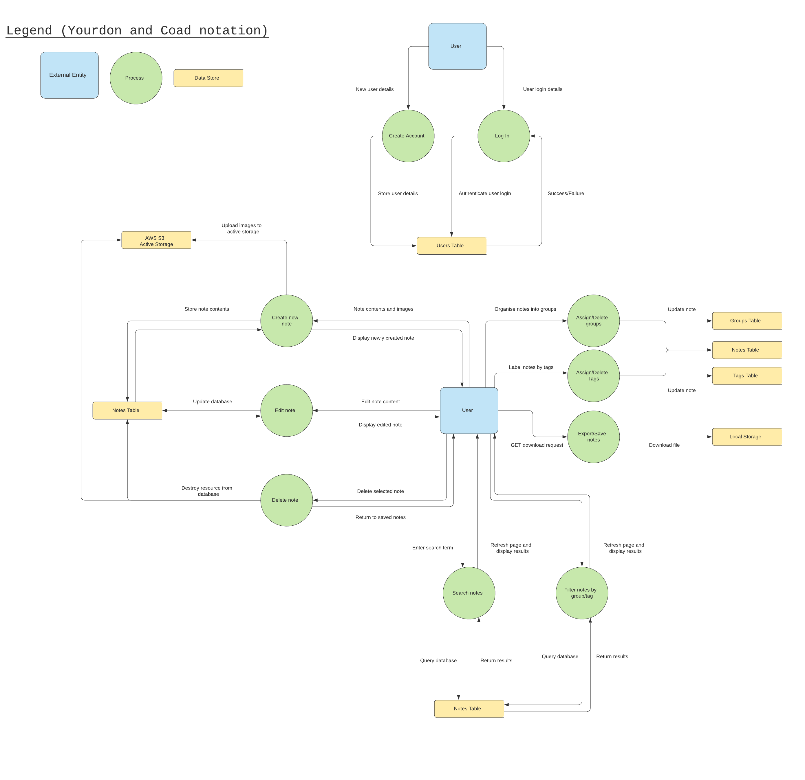

## Application Architecture Diagram

Link: https://lucid.app/lucidchart/d30ad452-8ff5-460d-9bb3-cc0da4fdfadd/edit?invitationId=inv_97834abe-af5f-4288-af0e-7217bad3aa78

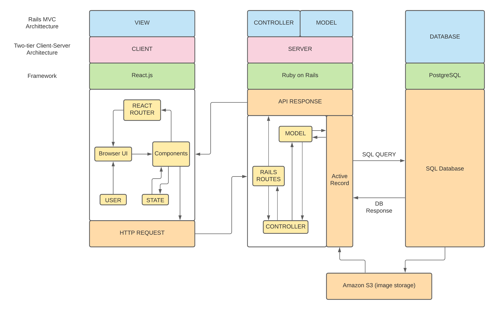

## User Stories

### User Personas

- **Johnny** - is an aspiring full-stack developer currently studying in the fast-track bootcamp at Coder Academy. Johnny keeps various notes from different class topics in his Google Docs files. These topics range from HTML and CSS to computer science fundamentals and PostgreSQL. He also has many different coding files containing code that he wrote in class or in exercises. His notes are as organized as can be on google docs, but he finds that it is not as organized as he would like. Google Docs is also not ideal for saving code examples in their native programming language format. He wishes he had a single application that he can store notes from different classes, including code examples from different programming languages, in one organized location online.
- **Wallace** - is a teaching assistant at Coder Academy, currently overlooking Johnny's fast-track class. Wallace hopes to foster collaboration between the students by encouraging communication and discussion. He also wants to help all the students to have the same understanding at the end of each class so that no students are left behind. He discovered that students sharing and comparing their notes after each class drastically increases their overall understanding of the content, and helps them form collaborative relationships outside of class. He wishes he had a platform where the students can make notes collaboratively during and after class.
- **Stacy** - is a professional full-stack developer currently working full-time. She is a recent graduate from Coder Academy, so she hopes to utilize her learned knowledge in her current job. It is sometimes difficult to find the right piece of code she previously used in class, from all of the saved files she has accumulated over time. She also wants to store new knowledge and design patterns she learns from work so that she can apply them in future projects. She finds its more helpful to save example code she wrote, rather than reference online code because she can understand the context better.

### MVP - user stories

- As **Johnny**, I want to create a new note, so that I can add a new note to my collection of notes
- As **Johnny**, I want to change the visibility of a note to private or public, so that I can control who sees the note in collaborative groups
- As **Johnny**, I want to filter my notes by programming language, so that I can view notes specific to that language
- As **Johnny**, I want to add images to my note, so that I can add reference images or photos from class to accompany the note
- As **Johnny**, I want to highlight syntax in my note, so that I place emphasis on particular words in the note
- As **Stacy**, I want to edit a note, so that I can update or modify my notes at any time as I receive new or updated information
- As **Stacy**, I want to delete a note, so that I can remove notes I no longer need
- As **Stacy**, I want to add and display code to the note, so that I can save examples from code that I have written before
- As **Stacy**, I want to sort my notes chronologically, so that I can view my notes by newest or oldest
- As **Stacy**, I want to search my notes, so that I can quickly find the right note using keywords
- As **Stacy**, I want to style and format my note, so that I can make the text in my note look the way I want to
- As **Stacy**, I want to view a summarized version of a note, so that I can view multiple notes at a time
- As **Stacy**, I want to expand a summarized version of a note, so that I can see the note in its entirety
- As **Wallace**, I want to create a group, so that I add the students from a class to share and collaborate notes

### Future updates - user stories

- As **Johnny**, I want to select which programming language the example code is, so that I can display the code in the correct format
- As **Johnny**, I want to share my note with another user, so that I can share my notes with my classmates or coworkers
- As **Stacy**, I want to download a note to my computer, so that I can save local copies and refer to them without access to the internet
- As **Wallace**, I want to create a group for other users, so that they can add notes collaboratively to the group for others to see
- As **Wallace**, I want to add users to my created group, so that I can control who has access to the group
- As **Wallace**, I want to remove users from my created group, so that I can control who has access to the group

## Wireframes

Register Page
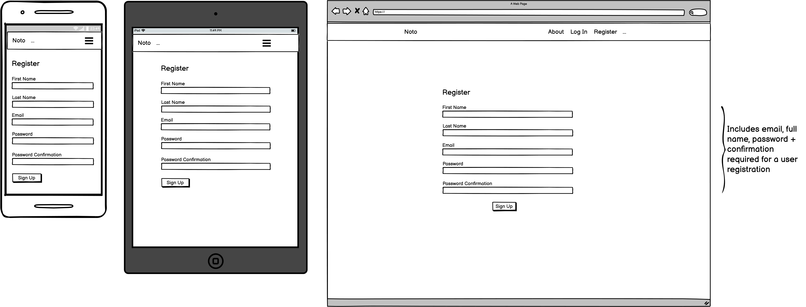

Index Page
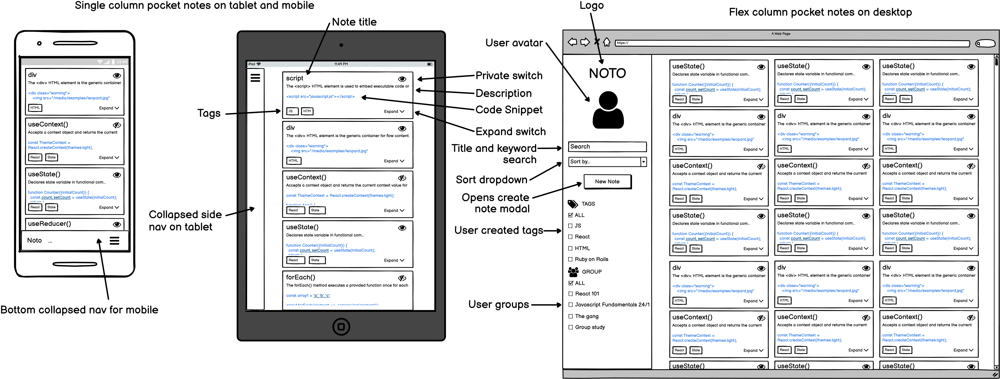

Expanded Note Page
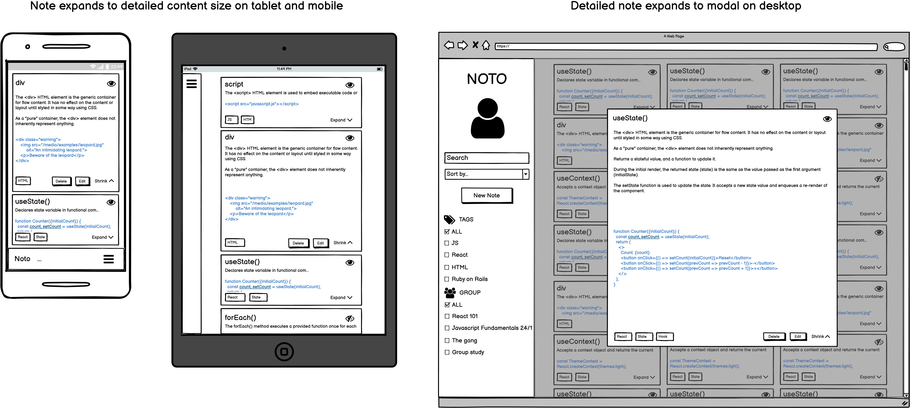

New Note Page
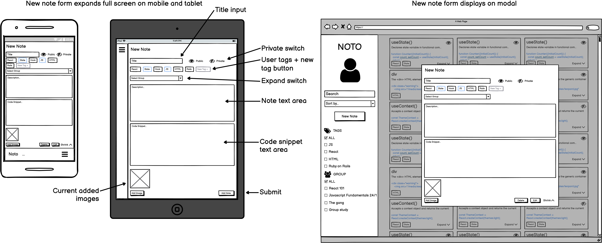

## Prototypes

Homepage
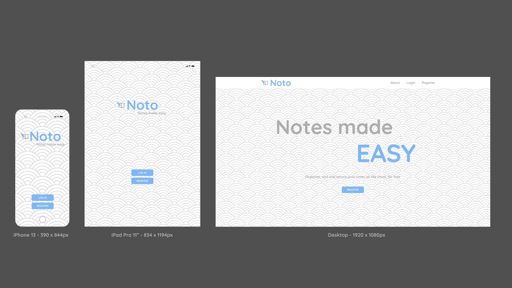

Log in Page
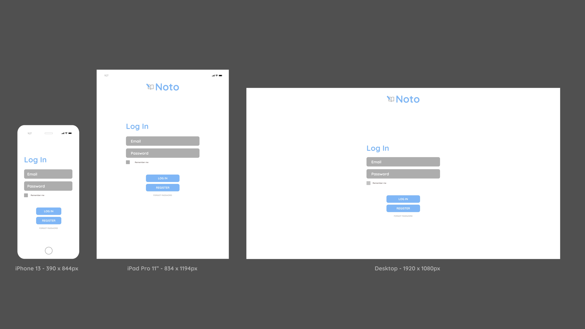

Register Page
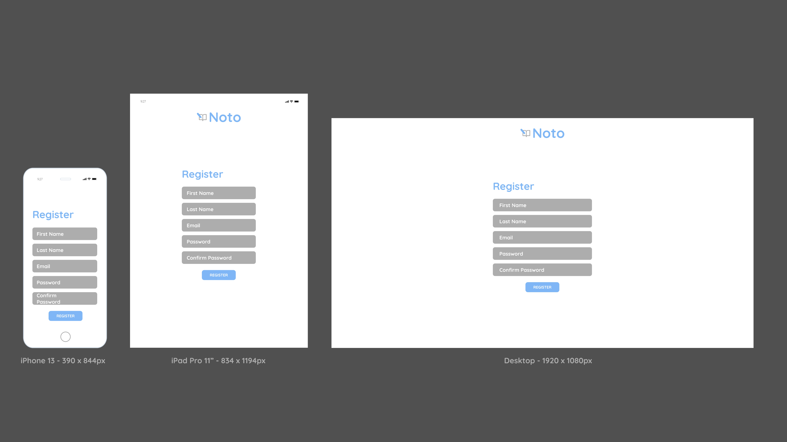

Forgot Password Page
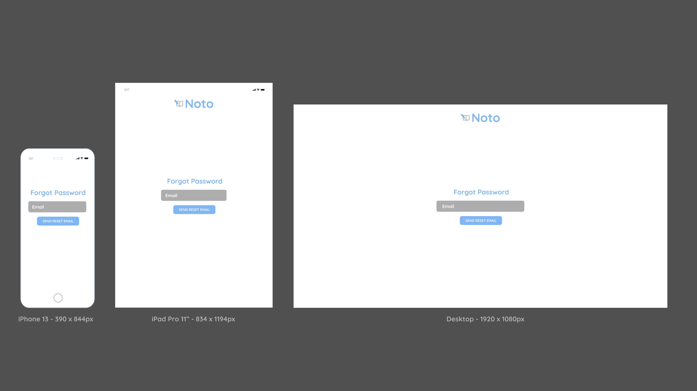

Index Page
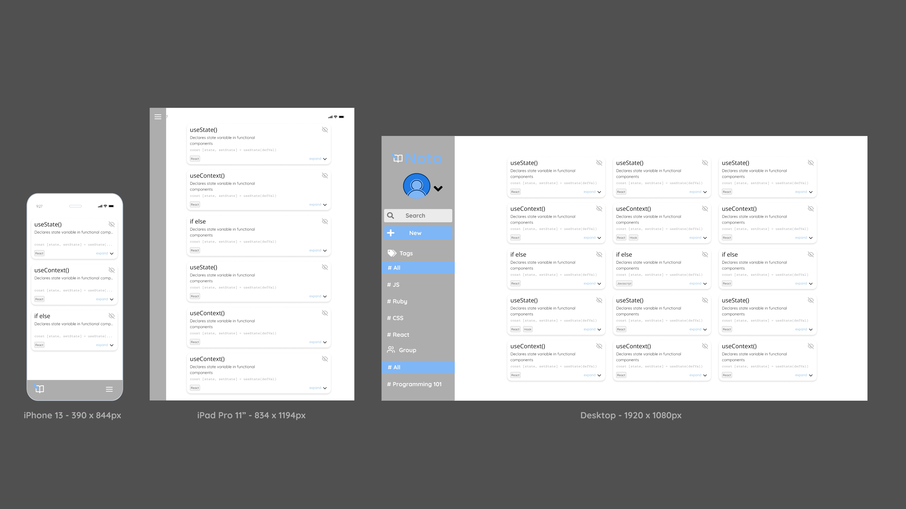

Expanded Note Page
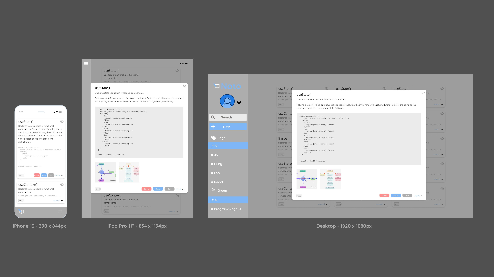

Nav
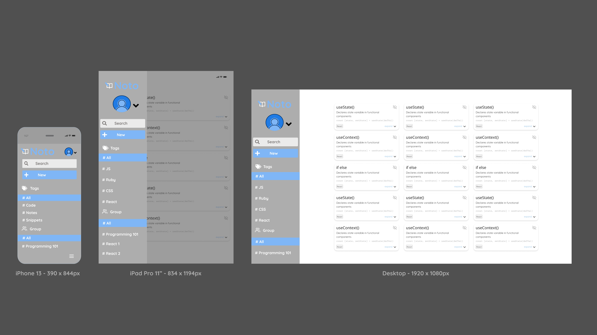

New Note Page
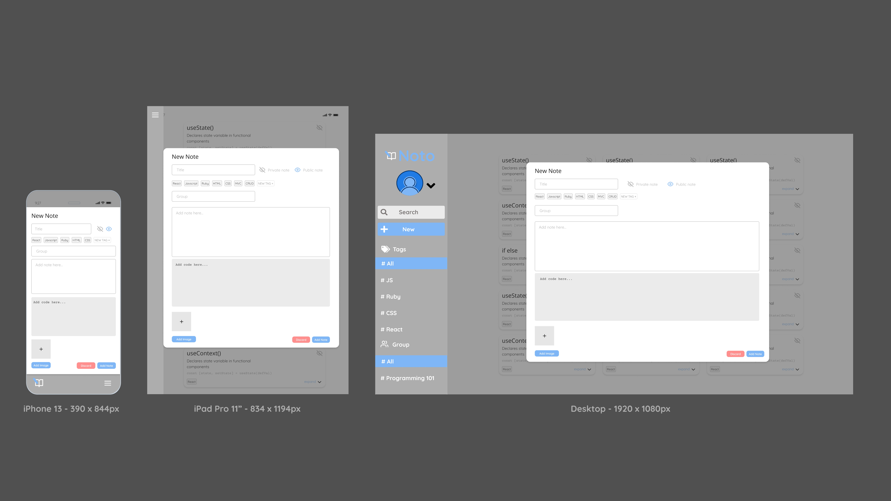

LInk: https://www.figma.com/file/dXzI59LuJz7YL4fzqnZwnJ/Noto?node-id=0%3A1

## Trello Screenshots

Trello screenshot 20/1/22
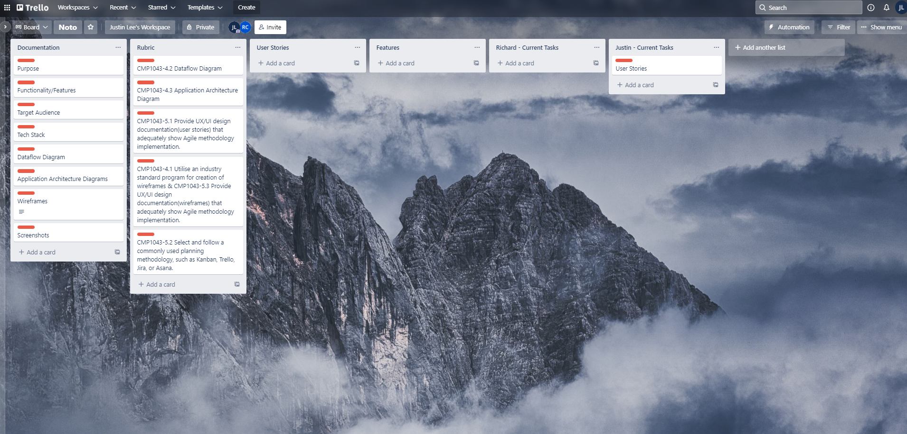

Trello screenshot 21/1/22
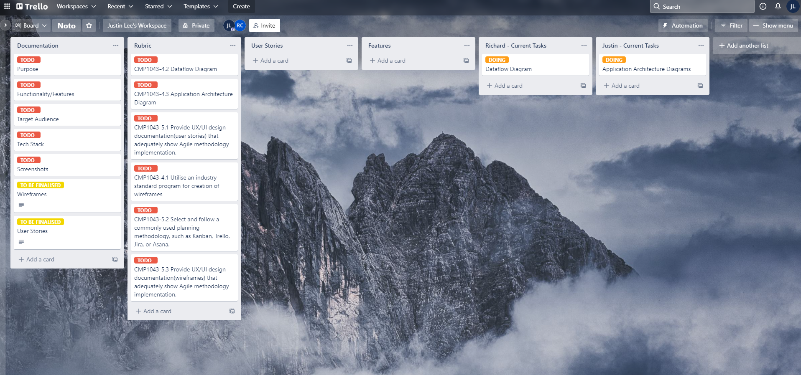

Trello screenshot 24/1/22
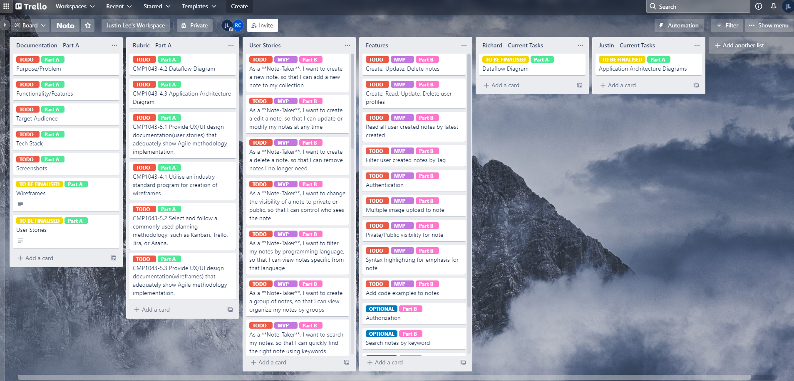

Trello screenshot 25/1/22
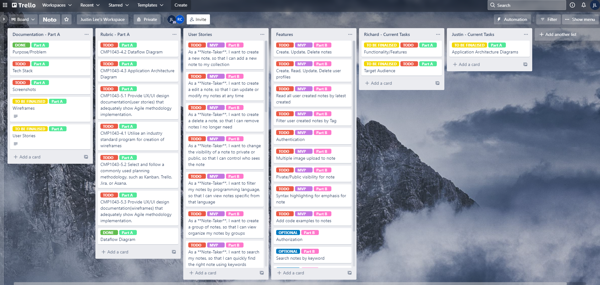

Trello screenshot 27/1/22
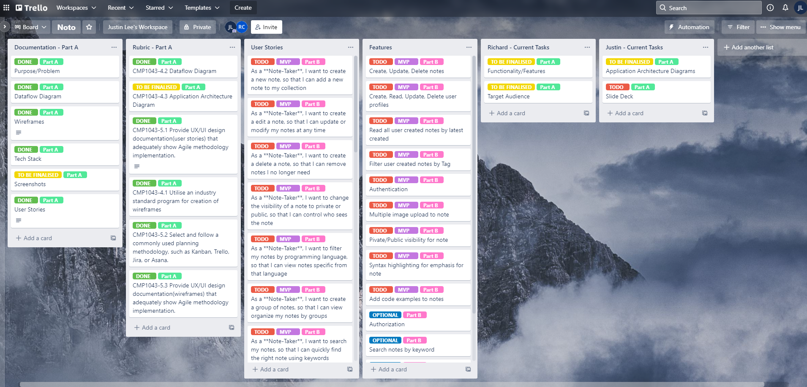

Trello screenshot 30/1/22
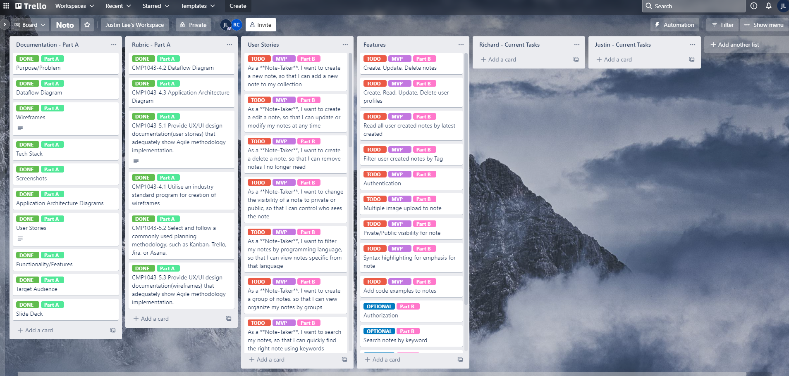

Link: https://trello.com/b/dS7iufSD/noto
